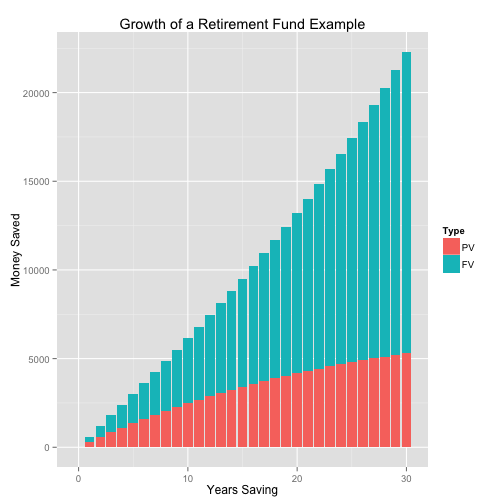

Watch Your Money GROW! 
========================================================
A Shiny app to help people save enough for retirement
--------------
author: 
date: March 19, 2015


Why Do I Care?
========================================================

More and more, people are not saving enough for retirement. DO NOT fall into the trap of thinking you will live forever! You won't! Modify the following to see how much you can have at retirement by saving regularly:

- Nominal interest rate (what the bank says)
- Inflation rate (How is the value of money changing?)
- Years until retirement (Want to work forever? NO!)
- Regular deposit (Even $10 helps!)
- Frequency of deposit (Every month? Every week?)

How It Works (Part I)
========================================================
First, it determines the *real* interest rate, taking inflation into account, using 
$$
r = \frac{1 + r_N}{1 + inflation} - 1,
$$ 
where $r_N$ is the nominal interest rate. For example, if $r_N = 0.07$ and $inflation = 0.03$, then the real interest rate is


```r
(r  <- (1 + 0.07)/(1 + 0.03) - 1)
```

```
[1] 0.03883495
```

How It Works (Cont.)
========================================================
Next, it uses the real interest rate, combined with the number of years of until retirement, the deposit amount, and how often it is deposited to find the present value (in today's dollars) of the money saved by retirement, before converting it to future dollars
$$
\begin{aligned}
PV &= \frac{A ( 1 - \left( \frac{1}{(1+r/n)^{nY}} \right)}{r/n} \\
F &= PV(1 + r/n)^{nY}
\end{aligned}
$$
where $PV$ is the present value, $A$ is the deposit amount, $r$ is the real interest rate, $n$ is the frequency of deposit, $Y$ is the number of years until retirement, and $F$ is the future value.

A Demonstration
==========================
Here's a plot of the growth of a retirement fund if you deposit $25/month for 30 years, with a nominal interest rate of 7% and an inflation rate of 3%. So get out there and save!!!




